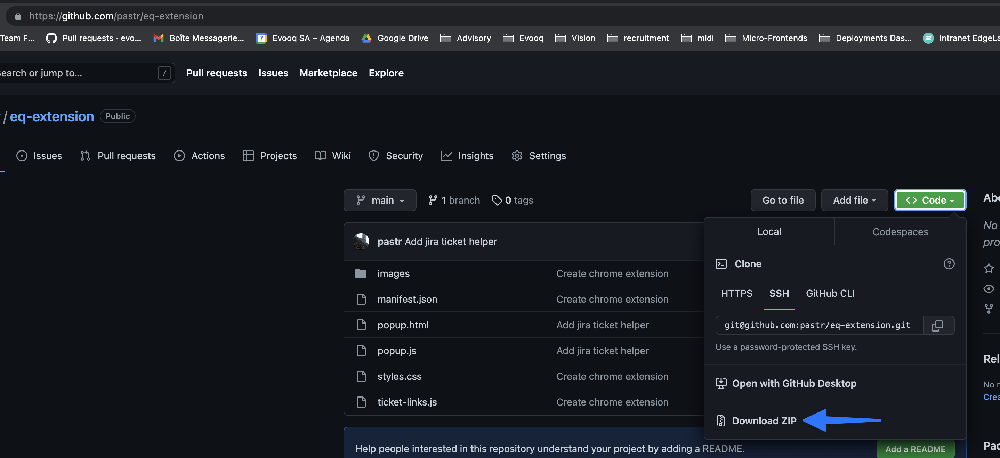
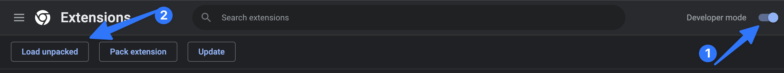
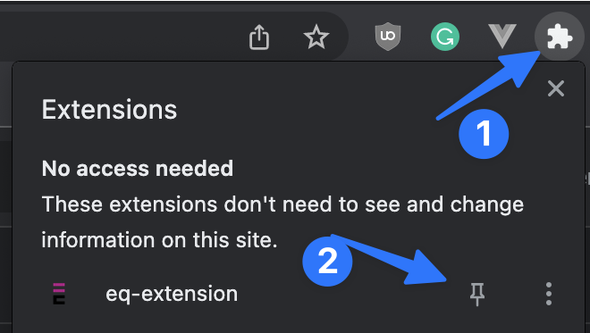

# Install

1) Clone or download the zip file and unzip it.

2) open chrome and go to `chrome://extensions/` 

3) Enable the developer mode and the click on "Load unpacked"

4) You now just have to select the extension directory and click select 

5) The app is now installed, you can pin it so it's easier to access it

## Demo
https://share.cleanshot.com/3u9tilkhCgwtOZqy2kyl 